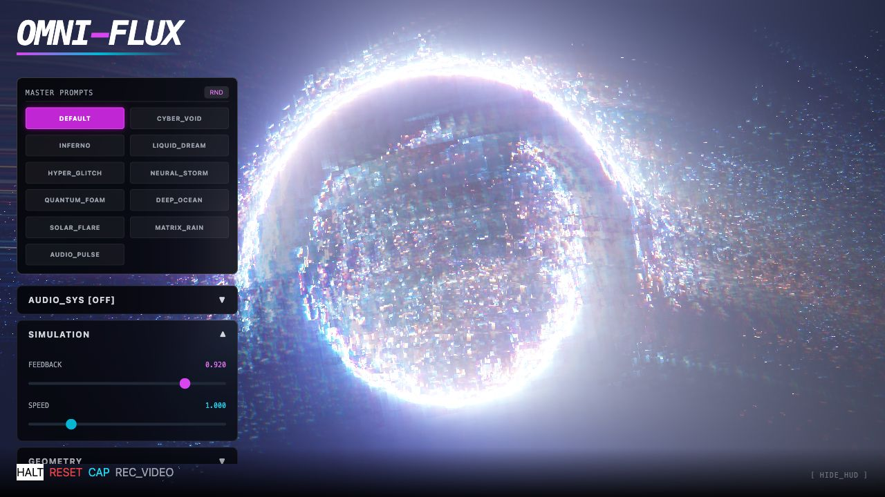
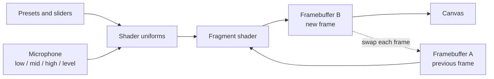

# OMNI-FLUX

A browser visualizer that draws fractal patterns with a WebGL2 fragment shader and feeds each frame back into the next.

[](LICENSE)

**Live demo:** https://neurabytelabs.github.io/omni-flux/ (needs WebGL2 and internet access, because the page loads Tailwind from `cdn.tailwindcss.com`)



## Why

Feedback shaders produce rich, evolving patterns from very little code: each frame is drawn on top of a warped copy of the previous one. OMNI-FLUX wraps one such shader in a small control panel, so you can explore it with presets, sliders and the microphone instead of editing GLSL.

## Quick start

You need Node.js (CI uses Node 20) and a browser with WebGL2.

```bash
git clone https://github.com/neurabytelabs/omni-flux.git
cd omni-flux
npm ci
npm run dev      # http://localhost:3000
npm run build    # output in dist/
```

`npm run preview` serves the built `dist/` folder.

## Usage

- 11 presets: DEFAULT, CYBER_VOID, INFERNO, LIQUID_DREAM, HYPER_GLITCH, NEURAL_STORM, QUANTUM_FOAM, DEEP_OCEAN, SOLAR_FLARE, MATRIX_RAIN, AUDIO_PULSE.
- 9 sliders: feedback, speed, zoom, complexity, distortion amplitude, distortion frequency, color shift, RGB split, brightness.
- Microphone input (Web Audio API) drives the shader parameters when you turn it on.
- Screenshot (PNG) and video recording (WebM, with an MP4 fallback) from the canvas.
- Touch gestures for zoom and color.

| Key | Action |
|-----|--------|
| `Space` | Pause or resume |
| `S` | Screenshot |
| `V` | Start or stop recording |
| `H` | Show or hide the panel |
| `R` | Reset parameters |
| `M` | Turn microphone input on or off |
| `1` to `0` | Select preset 1 to 10 |
| `←` `→` | Previous or next preset |

The eleventh preset (AUDIO_PULSE) has no number key; use the arrow keys or the button.

## How it works

The app is a single React component ([`components/Visualizer.tsx`](components/Visualizer.tsx)) around one fragment shader ([`constants.ts`](constants.ts)). Two framebuffers take turns: each frame the shader reads the previous frame from one, draws into the other, and the result is copied to the screen.



- Slider changes are eased toward their target each frame, so preset switches blend instead of jumping.
- [`utils/AudioEngine.ts`](utils/AudioEngine.ts) splits the microphone spectrum into low, mid and high bands plus an overall level.
- [`utils/RecordingManager.ts`](utils/RecordingManager.ts) records the canvas with `MediaRecorder`, preferring WebM.

### How it was made

The first version was generated in Google AI Studio (Gemini 3 Pro) from one structured prompt, and committed as one commit. Follow-up fixes were done in the same tool: [`demo/screenshots/05_code_assistant.jpg`](demo/screenshots/05_code_assistant.jpg) shows a later session that fixed a black-screen bug (float texture filtering) and edited two files. An earlier version of this README said "283 seconds, zero manual coding". The repo holds no log that proves that figure, so it was removed. The prompt text is not in this repo.

## Status / limits

Prototype.

- No tests. CI only type-checks, builds and deploys to GitHub Pages.
- Frame rate has not been measured.
- Touch gestures have not been tested on a phone.
- `index.html` loads Tailwind from a CDN and has an import map for React from `esm.sh`. The Vite build bundles React itself; the import map is left over from AI Studio.
- The feedback buffers use half-float textures when the browser supports `EXT_color_buffer_float`, and 8-bit textures otherwise, so trails can look different across GPUs.
- Recording uses the first format the browser's `MediaRecorder` supports (WebM, then MP4), but the file is always named `.webm`, even when it holds MP4.

## License

MIT. See [LICENSE](LICENSE).

Author: Mustafa Saraç, [NeuraByte Labs](https://github.com/neurabytelabs).
