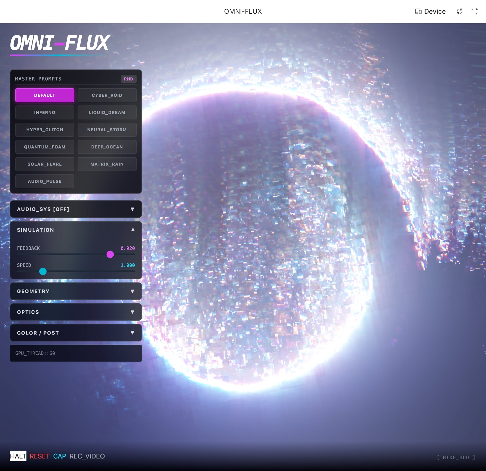

# OMNI-FLUX

OMNI-FLUX is a browser visualizer that draws fractal patterns with WebGL2 fragment shaders and feeds each frame back into the next.

**Status:** Prototype. No tests, no CI beyond the Pages build. I have not measured frame rate.
**Live:** https://neurabytelabs.github.io/omni-flux/ (needs WebGL2; the page loads Tailwind from `cdn.tailwindcss.com`, so it needs internet access)



## Run it

```bash
git clone https://github.com/neurabytelabs/omni-flux.git
cd omni-flux
npm ci
npm run dev      # http://localhost:3000
npm run build    # output in dist/
```

## What it does

- 11 presets: DEFAULT, CYBER_VOID, INFERNO, LIQUID_DREAM, HYPER_GLITCH, NEURAL_STORM, QUANTUM_FOAM, DEEP_OCEAN, SOLAR_FLARE, MATRIX_RAIN, AUDIO_PULSE.
- 9 sliders: feedback, speed, zoom, complexity, distortion amplitude, distortion frequency, color shift, RGB split, brightness.
- Microphone input (Web Audio API) drives the shader parameters when you turn it on.
- Screenshot (PNG) and WebM recording from the canvas.
- Touch gestures for zoom and color. I have not tested them on a phone.

| Key | Action |
|-----|--------|
| `Space` | Pause or resume |
| `S` | Screenshot |
| `V` | Start or stop recording |
| `H` | Show or hide the panel |
| `R` | Reset parameters |
| `M` | Turn microphone input on or off |
| `1` to `0` | Select preset 1 to 10 |
| `←` `→` | Previous or next preset |

The eleventh preset (AUDIO_PULSE) has no number key; use the arrow keys or the button.

## How it was made

The first version was generated in Google AI Studio (Gemini 3 Pro) from one structured prompt, and committed as one commit. Follow-up fixes were done in the same tool: `demo/screenshots/05_code_assistant.jpg` shows a later session that fixed a black-screen bug (float texture filtering) and edited two files. An earlier version of this README said "283 seconds, zero manual coding". The repo holds no log that proves that figure, so I removed it. The prompt text is not in this repo.

## Known limits

- `index.html` loads Tailwind from a CDN and has an import map for React from `esm.sh`. The Vite build bundles React itself; the import map is left over from AI Studio.
- Without the `OES_texture_float_linear` extension the shader falls back to nearest filtering (the fix from the screenshot above), so the look differs by GPU.

## License

MIT. See [LICENSE](LICENSE).

Author: Mustafa Saraç, [NeuraByte Labs](https://github.com/neurabytelabs).
